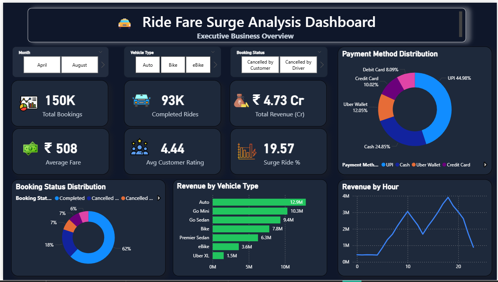
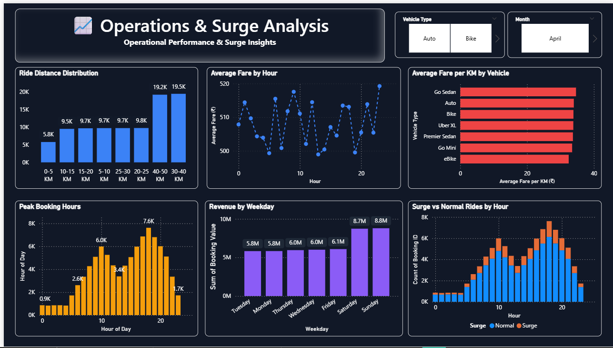
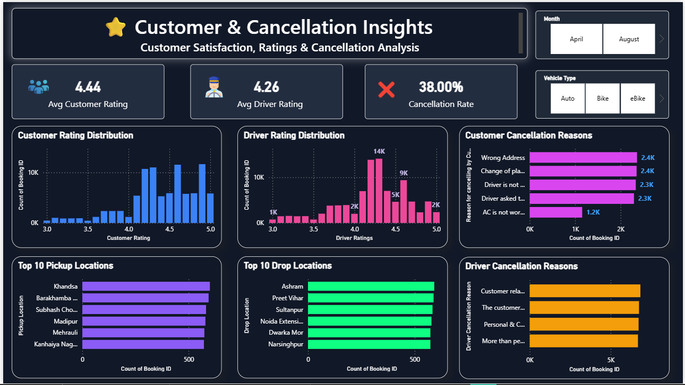

# 🚖 Ride Fare Surge Analysis

An end-to-end Data Analytics project built using Python, Jupyter Notebook, and Power BI.

# About the Project

This project analyzes ride booking data to understand booking trends, fare patterns, surge pricing, customer ratings, cancellations, and overall business performance.

The project follows a complete data analytics workflow, starting from raw data cleaning in Python to building an interactive dashboard in Power BI.

The goal is to convert raw ride booking data into meaningful business insights that can help improve operational decisions.

# Project Workflow

- Data Collection
- Data Cleaning
- Feature Engineering
- Exploratory Data Analysis (EDA)
- KPI Analysis
- Interactive Power BI Dashboard

# Tools & Technologies

- Python
- Pandas
- NumPy
- Matplotlib
- Seaborn
- Jupyter Notebook
- Power BI
- Git & GitHub

## Project Structure

Ride_Fare_Surge_Analysis/
│
├── dashboard/
│   └── Ride_Fare_Surge_Analysis.pbix
│
├── data/
│   ├── rides.csv
│   └── ride_fare_surge_cleaned.csv
│
├── notebooks/
│   └── Ride_Fare_Surge_EDA.ipynb
│
├── screenshots/
│   ├── page1_dashboard.png
│   ├── page2_dashboard.png
│   └── page3_dashboard.png
│
└── README.md

## Key Features

- Cleaned and prepared raw ride booking data using Python
- Performed feature engineering for better analysis
- Conducted Exploratory Data Analysis (EDA)
- Created business KPIs for performance monitoring
- Designed a 3-page interactive Power BI dashboard
- Added slicers for dynamic filtering
- Analyzed surge pricing, revenue, cancellations, ratings, and booking trends

## Dashboard Preview

1. Executive Business Overview

2. Operations & Surge Analysis

3. Customer & Cancellation Insights

## Business Insights

Some of the insights obtained from this analysis:

- Most bookings are completed successfully, while cancellations account for a smaller portion.
- Revenue varies across different vehicle types.
- Surge rides are more common during peak hours.
- Customer and driver ratings are generally above 4, indicating good service quality.
- Weekends generate higher booking revenue compared to weekdays.
- UPI is the most preferred payment method.
- Cancellation reasons help identify operational improvement areas.

## Future Improvements

- Build a machine learning model to predict surge pricing.
- Add real-time data integration.
- Publish the dashboard using the Power BI Service.
- Create automated reports using Power BI.

## Author
Uzma Khan

## Contact

Uzma Khan

- GitHub: https://github.com/Uzma-Khan-Tech16
- 
- LinkedIn: (Add your LinkedIn profile link)
